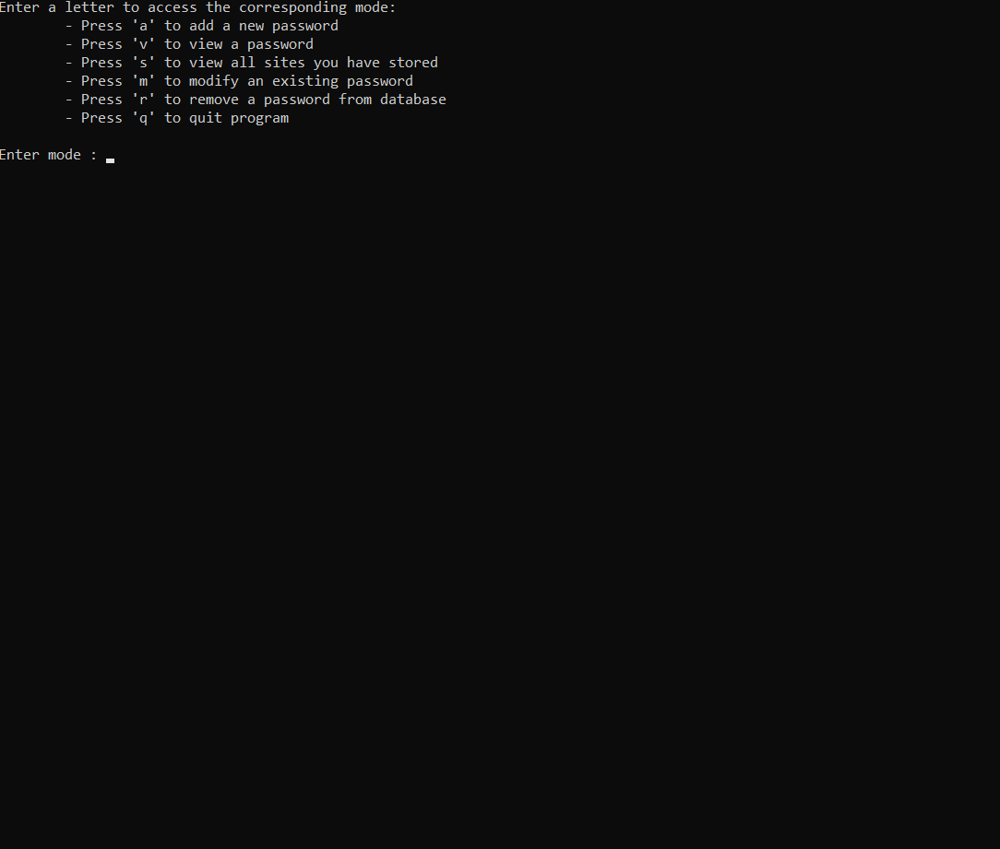

# password-manager



## About
#### This project is a CLI password manager that uses Fernet cryptography and MySQL to encrypt and store your passwords.

## Built With
- MySQL (mysql-connector for python)
- Fernet cryptography (python package)

# Getting Started

## 1. Clone Repository
#### In a terminal session, navigate to the directory where you wish to save this project.
  - Run command: `git clone https://github.com/Cudderson/password-manager.git`


## 2. Requirements
#### Install the required packages needed to run this project (virtual environment preferred):
- Navigate to the directory for this project and run command: `pip install requirements` 

#### This project uses `mysql-connector-python` to access and connect to a local MySQL database:

```
import mysql.connector

(-snip-)

# Retrieve password for database connection
with open('password.txt', 'r') as f:
    password = f.readline()


def connect_to_database():
    db = mysql.connector.connect(
        host='localhost',
        username='root',
        password=password,
        database='pm_db',
    )

    return db


pm_db = connect_to_database()

# Cursor for interacting with database
cursor = pm_db.cursor()

```

#### Notice the variable 'password' obtained from file :
```
# Retrieve password for database connection
with open('password.txt', 'r') as f:
    password = f.readline()
```

## 3. Create Password
### You will need to create a text-file titled `password.txt` in the base-directory of this project.
#### - Within `password.txt`, define your password for MySQL database connection on the first line.
#### - The `connect-to-database()` function will use this password directly in the Python script for connection.

## (Alternative)
#### - If you do not wish to store your MySQL password in a text file, you can hard-code it into the `connect-to-database()` function, and remove the file-reading code defined above. (Not Recommended)
#### - Alternatively, you can use any method for password storage that you prefer, so long as the `connect-to-database()` function's 'password' argument is properly fulfilled.

#### Refer to the MySQL Connector/Python documentation if you have an issue:
- https://dev.mysql.com/doc/connector-python/en/connector-python-introduction.html

## 4. Usage
### Once requirements are installed and you have defined your MySQL database password, this project is ready to run.
#### 1. If not already, (in terminal/IDE) navigate to the project's directory and run command:
### - `python main.py`
#### - Upon first-launch, the program will connect to your database, store an encryption key, and begin a prompt for a master password creation.
### - *Master password will be required to access the program after created; Don't forget it!*

## 5. Functionality
### This project uses a main dialogue loop to provide 'modes' for user to access the program's functions and communicate with the database.
### Available user functions:
#### - Add a password
#### - View a password
#### - Delete a password
#### - Modify a password
#### - View all passwords

### Entries in database are stored with an affiliate 'site' name (ex. Youtube), the password itself, and an 'entry_id' that links the Site and Password together through a foreign-key relationship.
### An example of the entry structure:
```
(1, 'myspace', 'gAAAAABgNc6jnKws4n3CyQXBr6nEh9dSnaCKbzJUEsCOu28UpxsFt1RWeeOGvCPytPl0Wa5ifrwnLEPXXbivCSjbBowvVp8rSQ==')
(2, 'youtube', 'gAAAAABgNc5EQWI7Jc8WPW-7I3LhJnOBFT3O7kPz7XoDbFQkhUkkQY_qVPiFILz3idXX5nbvPRRmuwlf85ybFKCMFqz1naPclA==')
(3, 'hogwarts', 'gAAAAABgNc64a3cWA6BN2d56X1pNYXv59XGAEgqPgCySahmVDhmTCMZPuOGEugsG4mW58ZIYqgH-OfscKDBSIAgHmMmoT_ev2w==')
```

## Fernet Encryption
### Reference: https://cryptography.io/en/3.4.6/fernet.html
##### `Fernet guarantees that a message encrypted using it cannot be manipulated or read without the key. Fernet is an implementation of symmetric (also known as “secret key”) authenticated cryptography.`

### This project's script will automatically save an encryption key within the project's files upon first-launch.
#### - Fernet uses symmetric encryption, meaning that the key used to encrypt values must also be the key used to decrypt those values.
#### - Because of this method, it is important that you do not alter the Fernet key in *any way*. Doing so could risk losing the passwords you have saved.

## 6. Warning
#### This is a personal project and is not-designed to be a hyper-secure, end-all place for secret information. Though passwords are encrypted legitimately, there is still risk. (Someone obtains your master password and/or Fernet key)

# Author/Contact
### Cody | Myself
#### - I'm an aspiring developer from the US. I've been programming for around 3 years and am looking for a professional opportunity.
### Contact me for anything related to this project, programming, hiring, or anything you'd like: - codered1227@gmail.com
#### Thanks for checking it out. If you enjoyed the project, consider giving it a 'star'!
